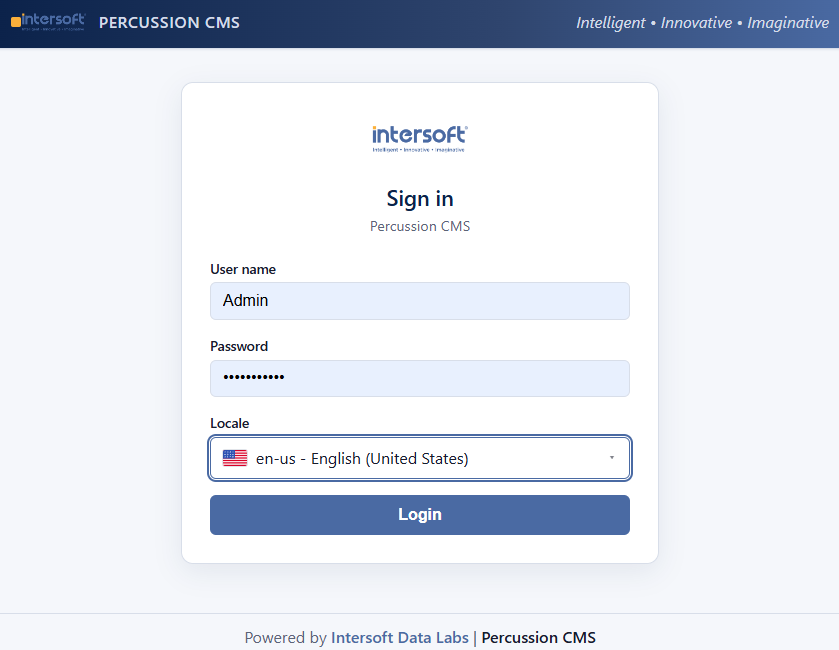

# Percussion CMS

**Actively maintained by [Intersoft Data Labs](https://www.intsof.com)** · Apache 2.0 · Formerly Percussion CM1 / Rhythmyx / CM System

[](https://opensource.org/licenses/Apache-2.0)
[](https://openjdk.org/)
[](https://github.com/intersoftdatalabs-in/percussioncms/releases)

<p align="center">
  
</p>

*The refreshed login experience in the current development line (heading toward 8.2).*

---

## What is Percussion CMS?

Percussion CMS is a mature, enterprise-grade, decoupled / headless-capable content management system with roots going back to 1999. It unifies the content production strengths of the original CM1 with the deep development and integration capabilities of Rhythmyx.

It was designed from the beginning for multi-channel delivery — websites, static sites, XML/JSON feeds, databases, and custom channels — with strong workflow, permissions, and extensibility for both marketers and developers.

**Smart architecture. Smart APIs. Smart UI.**

Intersoft Data Labs assumed full responsibility for support, maintenance, and ongoing development of the Percussion CMS product line in July 2023 after Percussion Software ended commercial support. This repository is the official open-source home of the **Java 21 / 8.2** product line under the Apache 2.0 license.

---

## Current Status (August 2026)

| Version / line | Status | Notes |
|----------------|--------|--------|
| **8.1.7** | Current **Java 8** stable release | Security hardening, WCAG 2.1 AA accessibility, Google Analytics 4, REST fixes — **downloads in the Java 8 repo** (see below) |
| **8.1.x** | Fully supported maintenance | Source and binaries: **[percussioncms-java8](https://github.com/intersoftdatalabs-in/percussioncms-java8)** (JDK 1.8) |
| **8.2** | Active development / modernization | This repository — performance, headless capabilities, UI modernization, Java 21 platform updates |

The **8.1.x (Java 8)** line remains fully supported. Work on the **8.2** release continues here with a focus on platform modernization, improved developer experience, and continued accessibility/security investment.

**If you run production on Java 8 / 8.1.x, upgrade to the latest 8.1.x release from the Java 8 repository** — recent releases contain important security patches.

---

## What can you do with it?

- Create and manage one or more websites (small sites to large multi-site deployments)
- Re-purpose content to databases, XML/JSON channels, or other delivery endpoints
- Generate static websites
- Enforce editorial control through robust workflows and fine-grained permissions
- Extend the platform with custom applications, templates, and integrations
- Run fully decoupled / headless or hybrid delivery models

---

## How do I get it?

### Java 21 / 8.2 (this repository)

**Binaries and installers** for the active product line will be published on this project’s  
[Releases page](https://github.com/intersoftdatalabs-in/percussioncms/releases) as 8.2 builds become available.

### Java 8 / 8.1.x downloads

**8.1.x installers and full release notes are published on the dedicated Java 8 LTS repository:**

| | |
|--|--|
| **Repository** | [intersoftdatalabs-in/percussioncms-java8](https://github.com/intersoftdatalabs-in/percussioncms-java8) |
| **All 8.1.x releases** | [percussioncms-java8/releases](https://github.com/intersoftdatalabs-in/percussioncms-java8/releases) |
| **Latest 8.1.x** | [v8.1.7](https://github.com/intersoftdatalabs-in/percussioncms-java8/releases/tag/v8.1.7) |

This repository may still list short **pointer** entries under Releases for discoverability; **use the Java 8 repo for download assets and complete 8.1.x notes**.

### Commercial Support & Services

**Intersoft Data Labs** is the exclusive commercial support and maintenance provider for Percussion CMS (all versions of CMS and Rhythmyx) since July 2023.

- Production support and SLAs
- Upgrade and migration assistance (including Java 8 → Java 21 paths)
- Custom development and integrations
- Hosting / managed services options

Contact: [inquire@intsof.com](mailto:inquire@intsof.com) · [intsof.com](https://www.intsof.com) · [Support Portal](https://percussionsupport.intsof.com)

Documentation lives at [percussioncmshelp.intsof.com](https://percussioncmshelp.intsof.com).

---

## Building from Source

**Requirements:** JDK 21 (`JAVA_HOME` must point to a JDK 21 installation).

```bash
# Linux / macOS
./mvnw clean install

# Windows
mvnw.cmd clean install
```

Detailed build instructions, environment setup, CodeQL configuration, and development guidelines are in the [Contributor Guide](https://github.com/intersoftdatalabs-in/percussioncms/blob/development/CONTRIBUTING.md).

For **Java 8 / 8.1.x** source builds, use [percussioncms-java8](https://github.com/intersoftdatalabs-in/percussioncms-java8) instead.

---

## Contributing

We welcome contributions. Please see the [Contributor Guide](https://github.com/intersoftdatalabs-in/percussioncms/blob/development/CONTRIBUTING.md) for coding standards, pull-request process, and development workflow.

This project follows the [Universal Code v1.0.0](docs/policies/UC-v1.0.0.md) (vendored; [upstream](https://github.com/monkeyking-hq/universal-code)).

- **Java 21 / 8.2 work** → open PRs against this repository  
- **Java 8 / 8.1.x maintenance** → open PRs against [percussioncms-java8](https://github.com/intersoftdatalabs-in/percussioncms-java8)

---

## Related repositories

| Repository | Role |
|------------|------|
| **[percussioncms](https://github.com/intersoftdatalabs-in/percussioncms)** (this repo) | Java **21** / **8.2** active development |
| **[percussioncms-java8](https://github.com/intersoftdatalabs-in/percussioncms-java8)** | Java **8** LTS — **8.1.x** maintenance and downloads |

---

## License

Apache License 2.0 — see [LICENSE](LICENSE) for details.

---

**Maintained with care by Intersoft Data Labs**  
Questions? Open an issue or reach out via the support portal.
